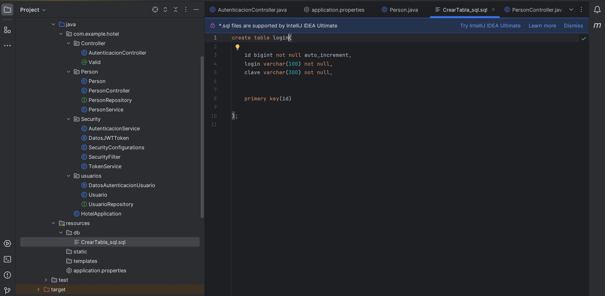
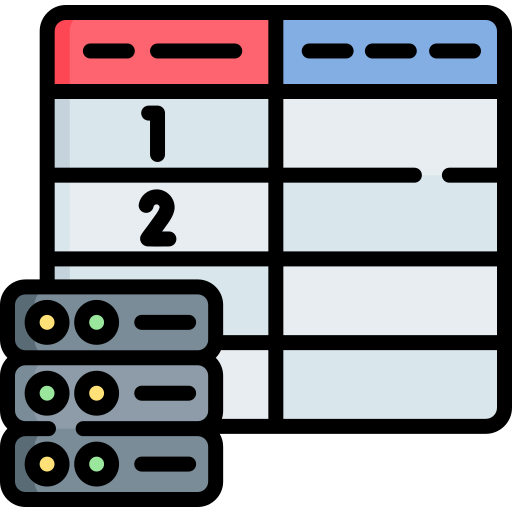
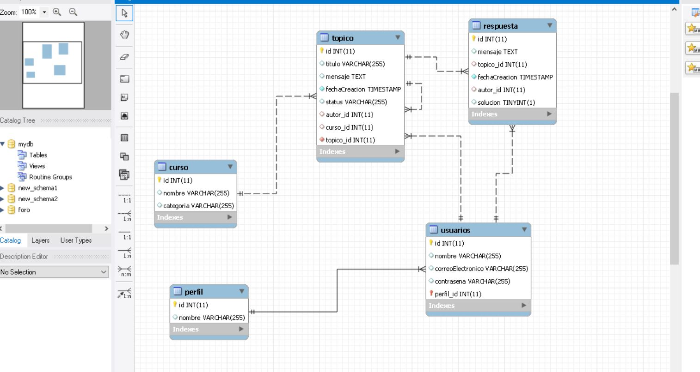
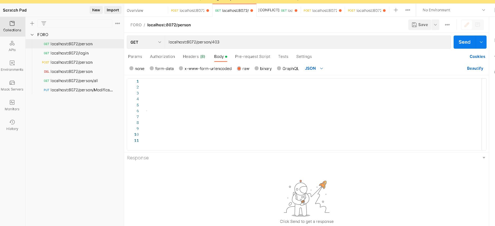

   
# Challenger-Foro--Alura
Bienvenidos al Challenger sobre el foro propuesto por Alura 
Video de la aplicación:
https://www.youtube.com/watch?v=GNavp28HDZM

# Instalación

<ol>
  <li>Clona este repositorio en tu máquina local:  git clone
   https://github.com/edcastilla/Challenger-Foro--Alura</li>
  <li>Abre el proyecto en su IDE Favorito.</li>
  <li>Recuerda tener instalado Java en tu sistema.</li>
</ol>
  

  
# Software y herramientas utilizadas.
IntelliJ id :https://www.jetbrains.com/es-es/idea/  
Spring initializr :https://start.spring.io/ 
JSON Web Tokens:https://jwt.io/ 
Spring Security:https://docs.spring.io/spring-security/reference/servlet/oauth2/resource-server/jwt.html 
bcript:https://bcrypt.online/ 
Mysql Workbench:https://www.mysql.com/products/workbench/ 
Postman:https://www.postman.com/ 
Java 17:https://www.oracle.com/java/technologies/downloads/ 
Spring data jpa:https://docs.spring.io/spring-data/jpa/reference/ 

# Estructura del proyecto

# Modelo Entidad Relacion

# Postman

# Autor
Edgar Castilla

